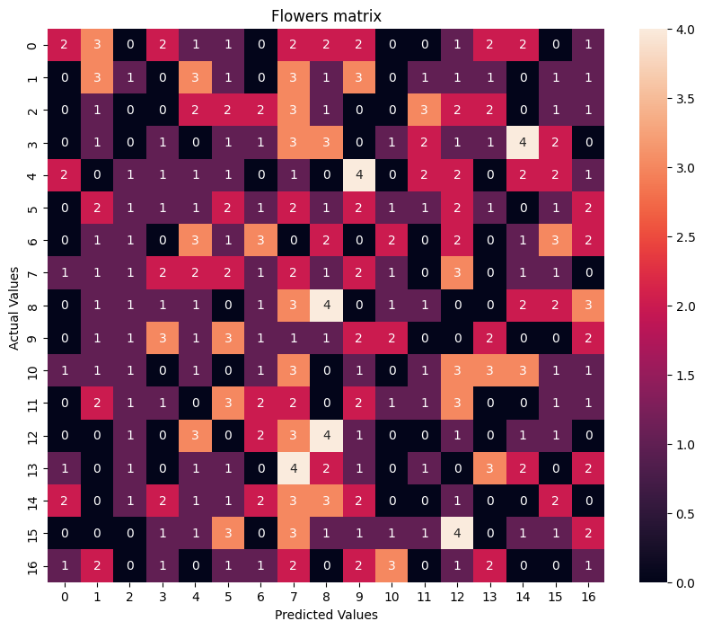

# 17 Flowers Classification🌹🪴
- A deep learning model using VGG16 convolution neural net is trained to classify flowers 🌹🪴
- Download the  dataset from link below:
  - [dataset](https://drive.google.com/drive/folders/15Wr7hNPvFhnpkYdTpypGFmq6mcQ6r-Sx)

- | Dataset |  Loss	| Accuracy 
    | :---         |     :---:      |          :---: |
    |Train  | 0.1701  | 0.9453  |
    |Val     | 1.3862    | 0.6497   |
    |test     |   1.7977 |  0.6265  |

- Matrix

   
