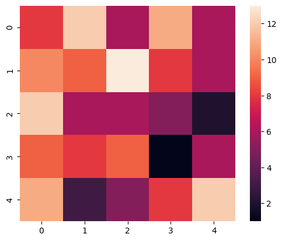

# 5Animals_Classification
- Classification between 4 animals:
   Elephant 🐘
    dog 🐶
    cat 🐈
    Giraffe 🦒
    Pandas 🐼
- Collect more than 200 photo data from each animal for Model training
- Using Augmentation To increase Train data
-  Matrix
   
- Download the  dataset from link below:
  - [dataset](https://drive.google.com/drive/folders/1wBUlG3P8YBiB17aUo3O6byzO0DJLcsaS)

-  | Train Loss | Train Acc| Val Acc |
   | :---         |     :---:      |          :---: |
   | 0.3229  | 0.8929   |0.6771   |

